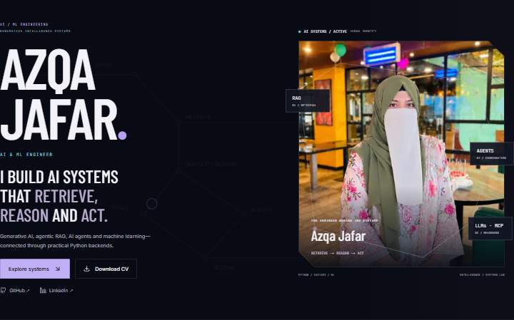
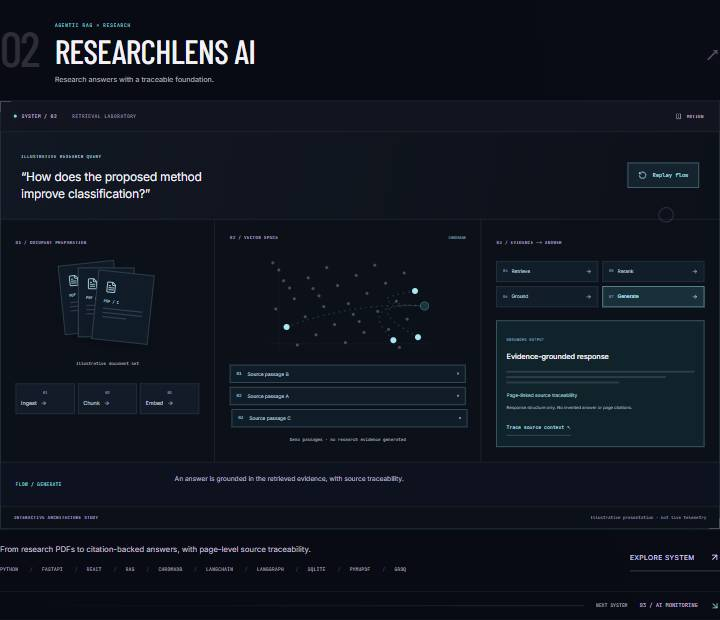

# Azqa Jafar — Intelligence / Systems Lab
A personal portfolio built with Next.js App Router, TypeScript, Tailwind CSS, Framer Motion, Lucide React, next/image, and next/font.



## Live site
Production deployment is awaiting Vercel account authorization. No public URL is claimed yet.

## Overview
An original AI engineering portfolio built around data → retrieval → reasoning → action. The reference portfolio served as a quality benchmark; the visual identity, content, and project diagrams are independently designed.

## Features
- Responsive dark portfolio with a supplied, unaltered professional photograph
- Five visual-first project chapters and matching case studies: multi-agent command graph, query-driven RAG laboratory, converging telemetry, knowledge constellation, and multi-plane imaging research
- Interactive system index, linked hover/focus paths, query replay, and per-system animation controls
- Supplied achievement photographs in alternating editorial features, with a native-dialog lightbox, keyboard navigation, and focus restoration
- Interactive conceptual intelligence blueprint with keyboard-selectable branches
- Optional 2.2-second session intro, pausable stack strip, scroll progress, and reduced-motion support
- Visual publication methodology and an experience ledger with a reserved date column and scroll progress
- Barlow Condensed display typography with Inter body text and restrained monospace labels
- Offscreen animation pausing and readable mobile-specific diagram arrangements
- CV-based experience, skills, education, achievements, and research
- Accessible navigation, reduced motion, and contact validation
- Server-rendered content, canonical metadata, social previews, Person structured data, robots, and sitemap



## Content sources
Professional information is based on the supplied `public/files/Azqa_Jafar_CV.pdf`; the downloadable copy lives at `public/Azqa_Jafar_CV.pdf`.
The current portrait is `public/images/profile/azqa-jafar.jpeg`. Supplied laptop-award and Honhaar scholarship photographs are in `public/images/recognition/`. Images are displayed with CSS crops and next/image; no faces are generated or altered.
Experience dates follow the user’s explicit latest correction: OCT 2025 — PRESENT at Minhaj Solution Software System and AUG 2025 — OCT 2025 at Efaida Technologies. These intentional corrections take priority over the older PDF dates.
No project screenshots or project-specific repository/demo links were supplied. Diagrams are labeled schematics and no missing results or implementation details are invented.
The supplied CV reports the publication date and 98.91% test accuracy. ScienceDirect blocked automated retrieval during development.

## Local setup
Requires Node.js 20.9+.
```sh
npm ci
cp .env.example .env.local
npm run dev
```
Open http://localhost:3000.

## Checks
```sh
npm run lint
npm run typecheck
npm run build
npm start
```

## Project structure
```text
src/app/               App Router pages, metadata, manifest, contact API
  projects/[slug]/     Generated case-study routes
src/components/        Intro, hero, systems, architecture, research, journey, UI
src/data/              Verified project, expertise, capability, and experience data
src/lib/site.ts        Profile links and production URL
src/types/             Shared portfolio types
public/               Supplied photograph and PDF
tests/                Browser checks
```

## Architecture
The homepage composes small section components. Professional data lives in src/data, including separate visual-system and milestone records; shared links live in src/lib, and project types in src/types. Interactive diagrams are client components; the main content and case studies are server rendered. Styling uses Tailwind CSS and custom responsive CSS. Motion uses CSS, SVG, and Framer Motion; no 3D engine is loaded. The SystemPanel, AnimatedFlow, FlowNode, FlowEdge, ProjectSystem, MultiAgentGraph, RAGPipeline, TelemetryPanel, KnowledgeGraph, ResearchPipeline, AchievementFeature, AchievementGallery, and ExperienceLedger components each have a bounded responsibility.

## Environment
Copy .env.example to .env.local. Never commit credentials.
- NEXT_PUBLIC_SITE_URL: final public HTTPS origin; used for all canonical and sitemap URLs
- RESEND_API_KEY: server-only Resend API key
- CONTACT_FROM: a sender on your verified Resend domain
- CONTACT_TO: destination email
- GOOGLE_SITE_VERIFICATION: optional Search Console verification code

The contact endpoint validates input, rejects cross-origin submissions, uses a honeypot, limits payload length, and times out delivery requests. Delivery is only reported as successful after the provider accepts the email. Without email credentials, the form explains that delivery is unavailable and prepares a mailto link containing the visitor’s subject and message. The visitor opens and sends that draft in their own email application; the site never claims it was sent. Enable platform rate limiting on /api/contact before exposing configured delivery to heavy public traffic.

## Deployment
Import the GitHub repository into Vercel using the Next.js preset and production branch main. Set NEXT_PUBLIC_SITE_URL to the assigned stable production domain, configure email variables through Vercel settings, and deploy. The URL fallback uses VERCEL_PROJECT_PRODUCTION_URL on Vercel and localhost only for local development.
Production checks must include homepage, all five projects, image, CV, metadata, /sitemap.xml, /robots.txt, mobile navigation, contact behavior, and HTTPS.

## Custom domain
In Vercel → Project → Settings → Domains, add your existing domain. Apply the exact DNS records Vercel shows at the registrar, wait for verification and HTTPS, choose the primary domain, update NEXT_PUBLIC_SITE_URL, and redeploy. No domain purchase is required for a vercel.app URL.

## Google Search Console
1. Open https://search.google.com/search-console and add a URL-prefix property matching the exact production HTTPS origin. For a domain you own, use a Domain property and the supplied DNS TXT record.
2. For URL-prefix verification, choose HTML tag, put the content value in GOOGLE_SITE_VERIFICATION, and redeploy; then click Verify. Alternatively use a supported verification method available to your account.
3. Open Sitemaps and submit sitemap.xml.
4. Use URL Inspection for the homepage and key project pages; run the live test and request indexing.
5. Monitor Page indexing and sitemap processing. Indexing timing and inclusion are not guaranteed.
6. If moving to a custom domain, verify the new property and submit its sitemap after updating canonical URLs.

## Preview and screenshots
The actual supplied portrait is used in the hero. Browser verification screenshots are generated in artifacts/ and excluded from Git. Add only reviewed website captures to documentation; never represent fabricated application screenshots as project evidence.

## Author
[Azqa Jafar on GitHub](https://github.com/azqajafardev) · [LinkedIn](https://linkedin.com/in/azqa-jafar)
[Research publication](https://www.sciencedirect.com/science/article/pii/S2090447926004843)

Repository: https://github.com/azqajafardev/azqa-jafar-portfolio

Production deployment is awaiting Vercel account authorization. See [verification results](docs/verification.md). No live URL is claimed yet.

Official references: [Vercel domains](https://vercel.com/docs/domains/working-with-domains/add-a-domain), [Search Console verification](https://support.google.com/webmasters/answer/9008080), [Google indexing requests](https://developers.google.com/search/docs/crawling-indexing/ask-google-to-recrawl).
